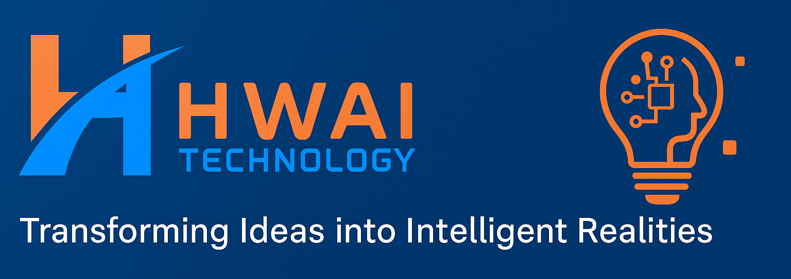

<!-- =========================================================== -->
<!--                   HWAI Technology README                    -->
<!-- =========================================================== -->

<p align="center">
  
</p>

<h1 align="center">HWAI Technology</h1>

<p align="center">
  <em>Transforming Ideas into Intelligent Realities</em>
</p>

---

## 🌍 About Us

**HWAI Technology** is a technology and innovation company based in **Málaga, Spain**, focused on creating next-generation software and AI-powered solutions that help organizations grow smarter and faster.

We design intelligent systems that combine **artificial intelligence, full-stack development, IoT integration, and cloud computing** to deliver meaningful impact in both private and public sectors.

---

## 💡 Mission & Vision

- **Mission:** To empower businesses and communities through intelligent, secure, and scalable digital ecosystems.
- **Vision:** Building the future of connected technology where AI meets human creativity.

---

## 🧠 Our Expertise

| Category                        | Description                                                                |
| ------------------------------- | -------------------------------------------------------------------------- |
| 🌐 **Web & Mobile Development** | Full-stack solutions built with Django, Spring Boot, and Vue/Nuxt.         |
| 🤖 **Artificial Intelligence**  | Computer vision, NLP, and predictive analytics with PyTorch & TensorFlow.  |
| 🏭 **IoT & Smart Systems**      | Edge computing and IoT dashboards for smart cities and industries.         |
| ☁️ **Cloud & DevOps**           | Deployment and CI/CD pipelines using Docker, RoadRunner, and Oracle Cloud. |
| 🧑‍🏫 **Education & R&D**          | Workshops, mentorship, and applied AI research projects.                   |

---

## 🚀 Flagship Projects

| Project                    | Description                                                                    |
| -------------------------- | ------------------------------------------------------------------------------ |
| **VisionGuard**            | AI-based weapon detection & privacy-preserving surveillance system.            |
| **Tourify**                | Smart tourism platform integrating e-bike rentals and geolocation features.    |
| **Smart Water Management** | IoT dashboard for real-time water optimization (🏆 Malackathon 2024 Finalist). |
| **Hospital Manager**       | Cloud medical management system with patient analytics.                        |
| **POS Suite**              | Scalable restaurant management solution (ordering, billing, inventory).        |

---

## 🧩 Tech Stack

```text
Languages: Python, Java, JavaScript, TypeScript, Go, PHP
Frameworks: Django, Spring Boot, NestJS, Slim, Vue/Nuxt, React
AI/ML: PyTorch, TensorFlow, YOLOv8, OpenCV, Scikit-Learn
Databases: PostgreSQL, MongoDB, MySQL, Oracle
DevOps: Docker, RoadRunner, GitHub Actions, WSL2
Cloud: Oracle Cloud, AWS, Google Cloud
```

---

## 👥 Team Members

| Name                            | GitHub                                               | Role                                    |
| ------------------------------- | ---------------------------------------------------- | --------------------------------------- |
| 🧑‍💻 **Eng. Ahmet Asaad Hammoud** | [@Eng-Ahmet](https://github.com/Eng-Ahmet)           | Founder & Software Engineer             |
| 👩‍💻 **Dania Ketaz**              | [@Daniaketaz](https://github.com/Daniaketaz)         | Back-End Developer & Software Engineer  |
| 👩‍💻 **Leen Alkour**              | [@LeenAlkour](https://github.com/LeenAlkour)         | Front-End Developer & Software Engineer |
| 👩‍💻 **Maya Shakko**              | [@mayashakko2001](https://github.com/mayashakko2001) | Back-End Developer & Software Engineer  |
| 👩‍💻 **Rania Alshebli**           | [@RaniaAlshebli](https://github.com/RaniaAlshebli)   | Front-End Developer & Software Engineer |
| 👩‍💻 **Halakamon**                | [@halakamon](https://github.com/halakamon)           | Front-End Developer & Software Engineer |

---

## 🌐 Contact & Socials

- **Website:** [https://hwai-technology.com](https://hwai-technology.com)
- **LinkedIn:** [HWAI Technology](https://www.linkedin.com/company/hwai-technology)
- **GitHub Organization:** [github.com/Hwai-technology](https://github.com/Hwai-technology)
- **Email:** [info@hwai-technology.com](mailto:info@hwai-technology.com)

---

## 📜 License

All content and projects in this repository are protected under the **HWAI Technology System License**.  
Unauthorized reproduction, resale, or distribution is strictly prohibited.

---

<p align="center">
  <em>© 2025 HWAI Technology System – All Rights Reserved.</em>
</p>
